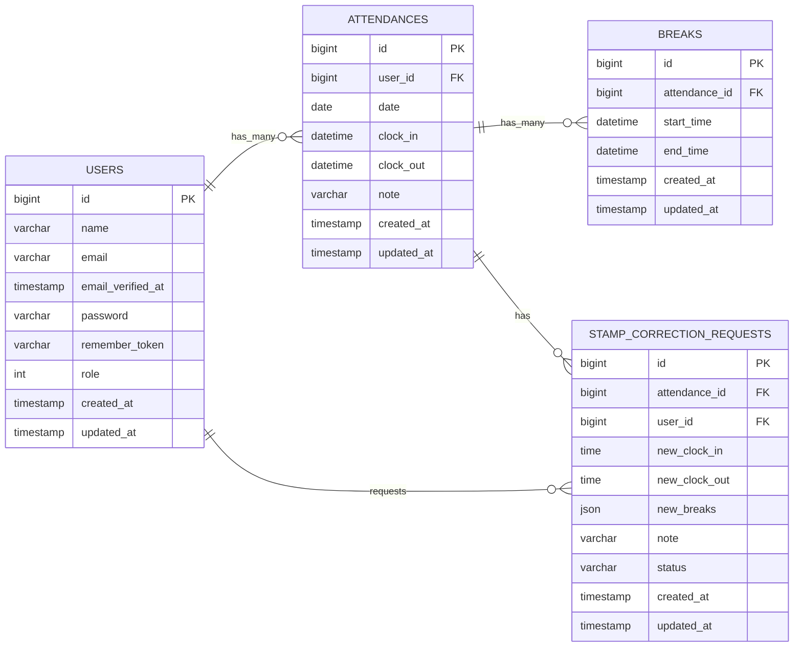

<h1>coachtech 勤怠管理アプリ</h1>

<h2>概要</h2>
・ある企業が開発した独自の勤怠管理アプリの設計、コーディング、テストの実施

<h2>環境構築</h2>

**Dockerビルド**

1.git clone  git@github.com:matsuyamashun/KINTAI.git

Http版はっておきます　　https://github.com/matsuyamashun/KINTAI.git

2.DockerDesktopアプリ立ち上げ

3.docker-compose up -d --build

MacのM1・M2チップのPCの場合、no matching manifest for linux/arm64/v8 in the manifest list entriesのメッセージが表示されビルドができないことがあります。 エラーが発生する場合は、docker-compose.ymlファイルの「mysql」内に「platform」の項目を追加で記載してください

**Laravel環境構築**

1.docker-compose exec php bash

2.composer install

3..env.exampleファイルを.envに変更。または、PHP内にて**cp .env.example .env**コマンドで新しく作成

4..envファイルの変更

**DB_CONNECTION=mysql**

**+　DB_HOST=mysql**

**DB_PORT=3306**

**+DB_DATABASE=laravel_db**

**+DB_USERNAME=laravel_user**

**+DB_PASSWORD=laravel_pass**

使用するブラウザによって違うかもしれないので違う場合はその都度変更おねがいします

5.アプリケーションキー作成

php artisan key:generate

6.マイグレーション実行

php artisan migrate

7.シーディングの実行

php artisan db:seed

<h2>ログイン情報</h2>

～一般ユーザー～

メールアドレス　user100@example.com

パスワード　password100

～管理者～

メールアドレス　admin111@example.com

パスワード　password111

<h2>使用技術</h2>

・PHP8.1.33

・Laravel 8.83.8

・MySQL8.0.44

<h2>ER図</h2>

こちら休憩を複数とれるよう勤怠と休憩でわけてあります
また、一般での勤怠の修正に管理者からの承認機能を設けているので STAMP_CORRECTION_REQUESTS　テーブル作成してます

<h2>URL</h2>

・  開発環境::http://localhost

．　メール認証::http://localhost:8025/

． phpMyAdmin::http://localhost:8080/

<h2>テスト</h2>

.PHPUnitを使用したFeatureテスト実装
