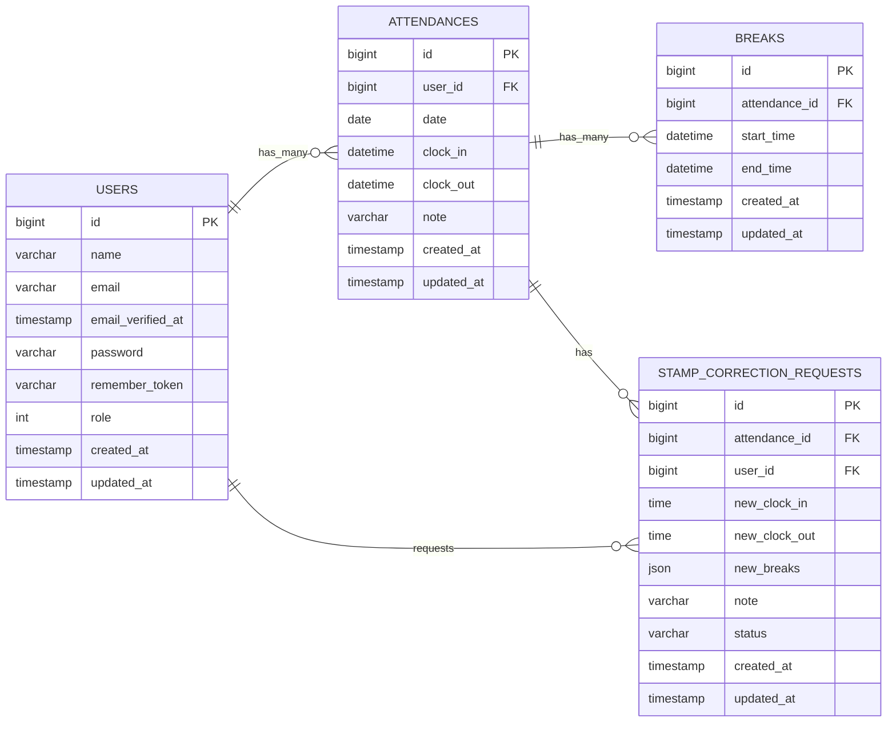

```mermaid
erDiagram
    direction LR

    USERS {
        bigint id PK
        varchar name
        varchar email
        timestamp email_verified_at
        varchar password
        varchar remember_token
        int role
        timestamp created_at
        timestamp updated_at
    }

    ATTENDANCES {
        bigint id PK
        bigint user_id FK
        date date
        datetime clock_in
        datetime clock_out
        varchar note
        timestamp created_at
        timestamp updated_at
    }

    BREAKS {
        bigint id PK
        bigint attendance_id FK
        datetime start_time
        datetime end_time
        timestamp created_at
        timestamp updated_at
    }

    STAMP_CORRECTION_REQUESTS {
        bigint id PK
        bigint attendance_id FK
        bigint user_id FK
        time new_clock_in
        time new_clock_out
        json new_breaks
        varchar note
        varchar status
        timestamp created_at
        timestamp updated_at
    }

    USERS ||--o{ ATTENDANCES : has_many
    ATTENDANCES ||--o{ BREAKS : has_many
    USERS ||--o{ STAMP_CORRECTION_REQUESTS : requests
    ATTENDANCES ||--o{ STAMP_CORRECTION_REQUESTS : has

```